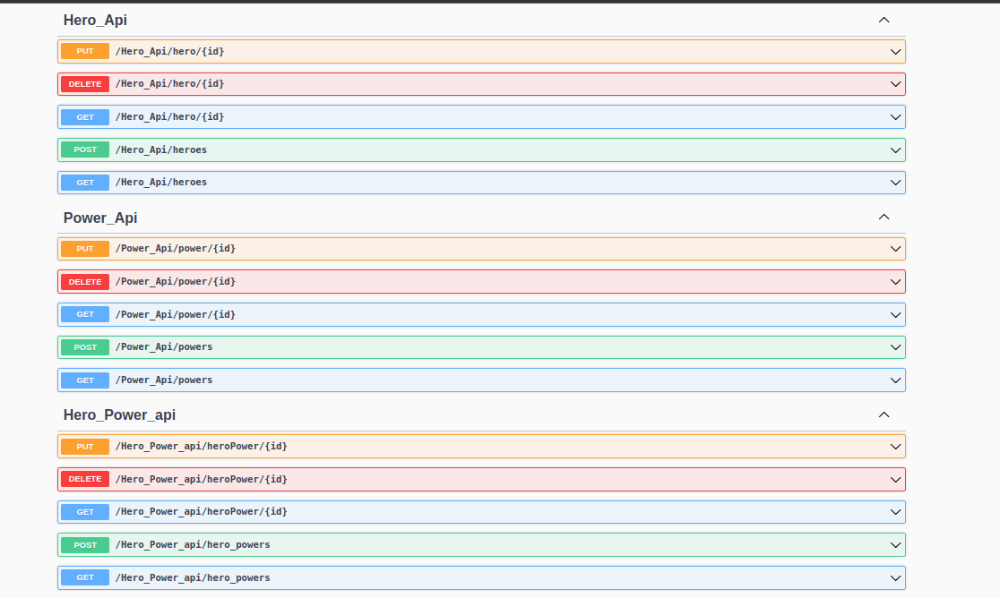

# Hero-Flask-Api


[](./LICENSE)




## Features

- Create a hero
- Get all heroes
- Find, update, or delete a hero by ID
- Create a power
- Get all powers
- Find, update, or delete a power by ID
- Associate hero with a power by creating HeroPower
- Find which hero has which power
- Find, update, or delete a HeroPower by ID
- Create a new HeroPower that is associated with an existing Power and Hero

## Installation

### 1. Clone the repository

```txt
git clone https://github.com/Bisinle/super-heroes-Flask-API
```

### 2. Navigate to the project's directory

```cd super-heroes-Flask-API

```

### 3. Install required dependencies

```pip install -r requirements.txt

```

### 4. Activate the virtual environment

```source venv/bin/activate

```

### 5. If needed, seed the database with

```python
python3 seed.py
```

### 6. Run the Flask server from the root directory

```python
python3 run.py
```

### 7. Use an API management tool e.g., `Postman` / `Insomnia` to make requests

## Usage
